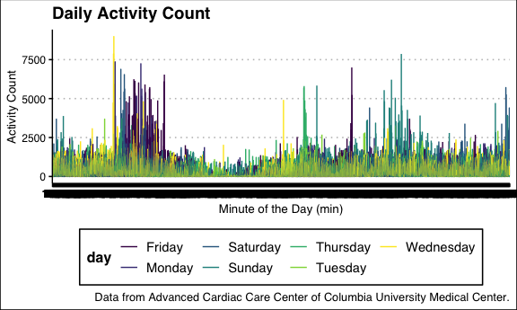
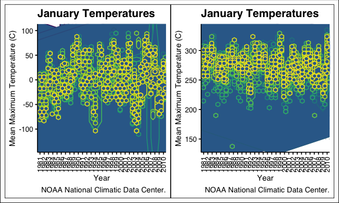

Homework 3
================
Alexey Abramov
10/6/2020

# Setup

``` r
library(tidyverse)
```

    ## ── Attaching packages ────────────────────────────────────── tidyverse 1.3.0 ──

    ## ✓ ggplot2 3.3.2     ✓ purrr   0.3.4
    ## ✓ tibble  3.0.3     ✓ dplyr   1.0.2
    ## ✓ tidyr   1.1.2     ✓ stringr 1.4.0
    ## ✓ readr   1.3.1     ✓ forcats 0.5.0

    ## ── Conflicts ───────────────────────────────────────── tidyverse_conflicts() ──
    ## x dplyr::filter() masks stats::filter()
    ## x dplyr::lag()    masks stats::lag()

``` r
library(patchwork)
library(hexbin)

knitr::opts_chunk$set(
  fig.width = 6,
  fig.asp = .6,
  out.width = "90%"
)

theme_set(
  ggthemes::theme_clean() + theme(legend.position = "bottom")
  )

options(
  ggplot2.continuous.colour = "viridis",
  ggplot2.continuous.colour = "viridis"
)

scale_colour_discrete = scale_color_viridis_d
scale_fill_discrete = scale_fill_viridis_d
```

## Load the dataset.

``` r
library(p8105.datasets)
data("instacart")
instacart
```

    ## # A tibble: 1,384,617 x 15
    ##    order_id product_id add_to_cart_ord… reordered user_id eval_set order_number
    ##       <int>      <int>            <int>     <int>   <int> <chr>           <int>
    ##  1        1      49302                1         1  112108 train               4
    ##  2        1      11109                2         1  112108 train               4
    ##  3        1      10246                3         0  112108 train               4
    ##  4        1      49683                4         0  112108 train               4
    ##  5        1      43633                5         1  112108 train               4
    ##  6        1      13176                6         0  112108 train               4
    ##  7        1      47209                7         0  112108 train               4
    ##  8        1      22035                8         1  112108 train               4
    ##  9       36      39612                1         0   79431 train              23
    ## 10       36      19660                2         1   79431 train              23
    ## # … with 1,384,607 more rows, and 8 more variables: order_dow <int>,
    ## #   order_hour_of_day <int>, days_since_prior_order <int>, product_name <chr>,
    ## #   aisle_id <int>, department_id <int>, aisle <chr>, department <chr>

### Problem 1

This dataset contains 1384617 rows and 15 columns.

How many aisles, and which are most items from? Here we are using the
count function and arranging from most to least.

``` r
aisles_df = instacart %>% 
  count(aisle) %>% 
  arrange(desc(n))
```

There are 134 aisles in this dataset.

Let’s make a plot of these data.

``` r
instacart %>% 
  count(aisle) %>% 
  arrange(desc(n)) %>% 
  filter(n > 10000) %>% 
  mutate(
    aisle = factor(aisle),
    aisle = fct_reorder(aisle, n)
  ) %>% 
  ggplot(aes(x = aisle, y = n)) +
  geom_point() +
  theme(axis.text.x = element_text(angle = 90, vjust = 0.5, hjust = 1))
```


Make a table with the three most popular items in these specific aisles:
baking ingredients, dog food care, and packaged vegetable fruits.

First we’ll get the aisles, count them, then rank them and put them in a
table.

``` r
instacart %>% 
  filter(aisle %in% c("baking ingredients", "dog food care", "packaged vegetables fruits")) %>% 
  group_by(aisle) %>% 
  count(product_name) %>% 
  mutate(rank = min_rank(desc(n))) %>% 
  filter(rank < 4) %>% 
  arrange(aisle, rank) %>% 
  knitr::kable()
```

| aisle                      | product\_name                                 |    n | rank |
| :------------------------- | :-------------------------------------------- | ---: | ---: |
| baking ingredients         | Light Brown Sugar                             |  499 |    1 |
| baking ingredients         | Pure Baking Soda                              |  387 |    2 |
| baking ingredients         | Cane Sugar                                    |  336 |    3 |
| dog food care              | Snack Sticks Chicken & Rice Recipe Dog Treats |   30 |    1 |
| dog food care              | Organix Chicken & Brown Rice Recipe           |   28 |    2 |
| dog food care              | Small Dog Biscuits                            |   26 |    3 |
| packaged vegetables fruits | Organic Baby Spinach                          | 9784 |    1 |
| packaged vegetables fruits | Organic Raspberries                           | 5546 |    2 |
| packaged vegetables fruits | Organic Blueberries                           | 4966 |    3 |

Apples versus ice cream.

If we want the average of a product at a certain time, we can use the
group\_by and then summarize functions.

``` r
instacart %>% 
  filter(product_name %in% c("Pink Lady Apples", "Coffee Ice Cream")) %>% 
  group_by(product_name, order_dow) %>% 
  summarize(mean_hour = mean(order_hour_of_day)) %>% 
  pivot_wider(
    names_from = order_dow,
    values_from = mean_hour) %>% 
    knitr::kable()
```

    ## `summarise()` regrouping output by 'product_name' (override with `.groups` argument)

| product\_name    |        0 |        1 |        2 |        3 |        4 |        5 |        6 |
| :--------------- | -------: | -------: | -------: | -------: | -------: | -------: | -------: |
| Coffee Ice Cream | 13.77419 | 14.31579 | 15.38095 | 15.31818 | 15.21739 | 12.26316 | 13.83333 |
| Pink Lady Apples | 13.44118 | 11.36000 | 11.70213 | 14.25000 | 11.55172 | 12.78431 | 11.93750 |

# Problem 2

Read in data and data wrangling.  
Here we are pivoting to longer to create minute and activity columns,
creating a weekday column that identifies weekday vs. weekend and then
creating the day of the week into a factor variable with 7 levels.

## Problem 2 Data Wrangling and EDA

``` r
accel_df = read_csv("./data/accel_data.csv") %>%
  pivot_longer(activity.1:activity.1440, 
      names_to = "minute", 
      values_to = "activity_count",
      names_prefix = "activity.") %>% 
  mutate(
    weekdays = case_when(
      day %in% c("Monday","Tuesday","Wednesday","Thursday","Friday") ~  
        "weekday",
      day %in% c("Saturday","Sunday") ~ "weekend")) %>% 
  group_by(day, day_id) %>% 
  mutate(
    day = factor(day)) %>% 
  ungroup()
```

    ## Parsed with column specification:
    ## cols(
    ##   .default = col_double(),
    ##   day = col_character()
    ## )

    ## See spec(...) for full column specifications.

Summarizing data here and performing some calculations by the day of the
week and performing a few group\_by calculations to learn more about
patterns in the dataset.

This is weekday vs. weekend

``` r
accel_summary1 = 
  accel_df %>% 
  group_by(weekdays) %>% 
    summarize(
      mean_daily_activity = mean(activity_count, na.rm = TRUE)) %>% 
    knitr::kable()
```

    ## `summarise()` ungrouping output (override with `.groups` argument)

``` r
accel_summary1
```

| weekdays | mean\_daily\_activity |
| :------- | --------------------: |
| weekday  |              282.5158 |
| weekend  |              228.3646 |

This is by day of the week.

``` r
accel_summary2 = 
  accel_df %>% 
  group_by(day) %>% 
    summarize(
      mean_daily_activity = mean(activity_count, na.rm = TRUE)) %>% 
    knitr::kable()
```

    ## `summarise()` ungrouping output (override with `.groups` argument)

``` r
accel_summary2
```

| day       | mean\_daily\_activity |
| :-------- | --------------------: |
| Friday    |              318.2931 |
| Monday    |              258.1526 |
| Saturday  |              190.1718 |
| Sunday    |              266.5574 |
| Thursday  |              290.4376 |
| Tuesday   |              249.8942 |
| Wednesday |              295.8017 |

This is week to week.

``` r
accel_summary3 = 
  accel_df %>% 
  group_by(week) %>% 
    summarize(
      mean_daily_activity = mean(activity_count, na.rm = TRUE)) %>% 
    knitr::kable()
```

    ## `summarise()` ungrouping output (override with `.groups` argument)

``` r
accel_summary3
```

| week | mean\_daily\_activity |
| ---: | --------------------: |
|    1 |              254.9467 |
|    2 |              320.6069 |
|    3 |              319.9321 |
|    4 |              190.4638 |
|    5 |              249.2707 |

### Discussion

The activity count data has 50400 rows and 6 columns. The rows reflect
activity count observed at every minute of the day. Columns serve to
group these data by week and day of the week. There is an additional
column that groups the day of the week by weekday and weekend.

The above summarized data show mean activity counts calculated by day of
the week, weekday vs. weekend and also week to week. Provided these
data, we can appreciate that this individual is more active and
weekdays, less active and weekends. More specifically, he is most active
on Fridays and least active on Saturdays. Lastly, he was most active in
the 2nd and 3rd week.

## Problem 2 Plots

Recreating the summary table.

``` r
accel_summary2b = 
  accel_df %>% 
  group_by(day) %>% 
    summarize(
      mean_daily_activity = mean(activity_count, na.rm = TRUE)) 
```

    ## `summarise()` ungrouping output (override with `.groups` argument)

``` r
accel_summary2b
```

    ## # A tibble: 7 x 2
    ##   day       mean_daily_activity
    ##   <fct>                   <dbl>
    ## 1 Friday                   318.
    ## 2 Monday                   258.
    ## 3 Saturday                 190.
    ## 4 Sunday                   267.
    ## 5 Thursday                 290.
    ## 6 Tuesday                  250.
    ## 7 Wednesday                296.

Hm. This a plot of the daily averages across the week.

``` r
accel_plot1 = 
  accel_summary2b %>% 
  ggplot(aes(x = day, y = mean_daily_activity)) +
  geom_point()
```

``` r
accel_plot2 = 
  accel_df %>% 
  ggplot(aes(x = minute, y = activity_count, color = day)) +
  geom_line() +
  ggtitle("Daily Activity Count") +
  xlab("Minute of the Day (min)") +
  ylab("Activity Count")
accel_plot2
```



Example to also consider, daily activity counts by day. Here is the
Friday activity count.

``` r
accel_plot3 = 
  accel_df %>% 
  filter(day == "Friday") %>% 
  ggplot(aes(x = minute, y = activity_count)) +
  geom_line() +
  ggtitle("Friday Activity Count") + 
  xlab("Minute of the Day (min)") +
  ylab("Activity Count")
accel_plot3
```


# Problem 3

## Problem 3 Data Wrangling and EDA

Read in the dataset.

``` r
library(p8105.datasets)
data("ny_noaa")
```

Beginning with data wrangling.

``` r
ny_noaa_tidy = 
  ny_noaa %>% 
  separate(date, into = c("year", "month", "day"), sep = "-") %>% 
  mutate(
    tmin = as.numeric(tmin),
    tmax = as.numeric(tmax),
    month = as.integer(month),
    day = as.numeric(day)
    )
```

Creating a month name tibble.

``` r
month_df = 
  tibble(
    month = 1:12,
    month_name = month.name)
```

Left joining month name tibble and ny\_noaa

``` r
ny_noaa_tidy = 
  left_join(ny_noaa_tidy, month_df, by = "month")
```

``` r
ny_noaa_tidy %>% 
  group_by(month_name, month) %>% 
  mutate(
    month_name = factor(month_name)
    ) %>% 
  ungroup()
```

    ## # A tibble: 2,595,176 x 10
    ##    id          year  month   day  prcp  snow  snwd  tmax  tmin month_name
    ##    <chr>       <chr> <int> <dbl> <int> <int> <int> <dbl> <dbl> <fct>     
    ##  1 US1NYAB0001 2007     11     1    NA    NA    NA    NA    NA November  
    ##  2 US1NYAB0001 2007     11     2    NA    NA    NA    NA    NA November  
    ##  3 US1NYAB0001 2007     11     3    NA    NA    NA    NA    NA November  
    ##  4 US1NYAB0001 2007     11     4    NA    NA    NA    NA    NA November  
    ##  5 US1NYAB0001 2007     11     5    NA    NA    NA    NA    NA November  
    ##  6 US1NYAB0001 2007     11     6    NA    NA    NA    NA    NA November  
    ##  7 US1NYAB0001 2007     11     7    NA    NA    NA    NA    NA November  
    ##  8 US1NYAB0001 2007     11     8    NA    NA    NA    NA    NA November  
    ##  9 US1NYAB0001 2007     11     9    NA    NA    NA    NA    NA November  
    ## 10 US1NYAB0001 2007     11    10    NA    NA    NA    NA    NA November  
    ## # … with 2,595,166 more rows

Most common values using the count and rank functions.

``` r
ny_noaa_snow = ny_noaa_tidy %>% 
  filter(snow > 0) %>% 
  count(snow) %>% 
  arrange(desc(n)) %>% 
  mutate(rank = min_rank(desc(n))) %>% 
  filter(rank < 4) %>% 
  knitr::kable()
```

The most common amount of snowfall recorded was 25mm, 13mm and 51mm.

Making a January plot:

``` r
ny_noaa_temp_Jan_plot = ny_noaa_tidy %>% 
  group_by(id, month_name, year) %>% 
  filter(month_name == "January") %>% 
  summarize(
    mean_max_temp = mean(tmax, na.rm = TRUE)) %>% 
  drop_na() %>% 
  ggplot(aes(x = year, y = mean_max_temp, group = id, color = id)) + 
  geom_hex() + theme(legend.position = "none") + 
  theme(axis.text.x = element_text(angle = 90, vjust = 0.5, hjust = 1))  +
  ggtitle("January Temperatures") +
  xlab("Year") +
  ylab("Mean Maximum Temperature (C)")
```

    ## `summarise()` regrouping output by 'id', 'month_name' (override with `.groups` argument)

Making a July plot:

``` r
ny_noaa_temp_July_plot = ny_noaa_tidy %>% 
  group_by(id, month_name, year) %>% 
  filter(month_name == "July") %>% 
  summarize(
    mean_max_temp = mean(tmax, na.rm = TRUE)) %>% 
  drop_na() %>% 
  ggplot(aes(x = year, y = mean_max_temp, group = id, color = id)) + 
  geom_hex() + 
  theme(legend.position = "none") + 
  theme(axis.text.x = element_text(angle = 90, vjust = 0.5, hjust = 1)) +
  ggtitle("July Temperatures") +
  xlab("Year") +
  ylab("Mean Maximum Temperature (C)")
```

    ## `summarise()` regrouping output by 'id', 'month_name' (override with `.groups` argument)

Two plots

``` r
ny_noaa_temp_Jan_plot + ny_noaa_temp_July_plot
```



### Discussion

These two plots of January and July temperatures from all the reporting
weather stations in New York across the years demonstrate a trend toward
increasing temperatures in January with wider variance as compared to
July temperatures which appear to remain fairly similar over time.

``` r
ny_noaa_tidy %>% 
  ggplot(aes(x = tmin, y = tmax)) + geom_hex()
```

    ## Warning: Removed 1136276 rows containing non-finite values (stat_binhex).


Problem 2 Notes 1. Pivot longer, day, activity count in every minute of
the day, and check minute of the day in numeric 2. Add a variable for
weekday and then weekend with mutate, and use factors so the day of the
week is sensible.  
3\. Variable class 4. Group\_by week and then day, and summarize problem
5. ggplot with geom\_line

Problem 3 Notes 1. Separate 2. Count for most commonly observed, rank?
3. Group\_by and summarize, then filter 4. Then ggplot 5. Two panel with
faceting 6. Two distinct plots with patchwork 7. tmax and tmin is a
scatterplot, but probably better with contour or hexplot 8. filtering
with ridgeplots
